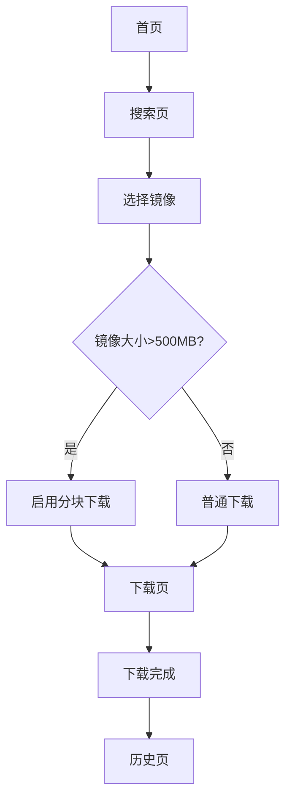

## 1. 产品概述
专业的容器镜像下载网站，支持多镜像源配置、聚合搜索、大文件断点续传下载。为开发者和运维人员提供高效、稳定的镜像下载服务，解决镜像下载慢、源不稳定等问题。

## 2. 核心功能

### 2.1 用户角色
| 角色 | 注册方式 | 核心权限 |
|------|----------|----------|
| 普通用户 | 无需注册 | 搜索镜像、下载镜像、管理下载历史 |
| 高级用户 | 邮箱注册 | 自定义镜像源、下载队列管理、云同步 |

### 2.2 功能模块
核心功能包含以下主要页面：
1. **首页**: 镜像搜索、热门镜像推荐、下载状态概览
2. **搜索页**: 多源聚合搜索、筛选条件、搜索结果展示
3. **下载页**: 下载队列、进度显示、速度控制、暂停/继续
4. **历史页**: 下载历史记录、筛选排序、重新下载
5. **配置页**: 镜像源管理、优先级设置、存储配置

### 2.3 页面详情
| 页面名称 | 模块名称 | 功能描述 |
|----------|----------|----------|
| 首页 | 搜索模块 | 输入镜像名称进行搜索，支持模糊匹配和自动补全 |
| 首页 | 热门镜像 | 展示下载量TOP10的镜像，点击直接跳转下载 |
| 首页 | 下载状态 | 显示当前下载任务数量和总体进度 |
| 搜索页 | 搜索条件 | 按名称、标签、架构、镜像源筛选 |
| 搜索页 | 结果展示 | 显示镜像详细信息、大小、更新时间 |
| 搜索页 | 批量操作 | 支持多选镜像加入下载队列 |
| 下载页 | 队列管理 | 显示等待中、下载中、已完成的任务 |
| 下载页 | 进度显示 | 实时显示下载速度、剩余时间、完成百分比 |
| 下载页 | 断点续传 | 超过500MB自动分块，支持中断恢复 |
| 历史页 | 历史记录 | 按时间倒序展示所有下载记录 |
| 历史页 | 筛选功能 | 按时间范围、镜像名称、状态筛选 |
| 历史页 | 操作功能 | 重新下载、删除记录、查看详情 |
| 配置页 | 镜像源管理 | 添加/删除/编辑镜像源，设置优先级 |
| 配置页 | 存储配置 | 选择本地存储路径，设置最大并发数 |

## 3. 核心流程

### 用户下载流程
1. 用户在首页或搜索页输入镜像名称
2. 系统聚合多个镜像源返回搜索结果
3. 用户选择目标镜像并配置下载参数
4. 系统根据镜像大小决定是否启用分块下载
5. 下载过程中实时显示进度和状态
6. 下载完成后自动校验文件完整性
7. 记录下载历史并更新统计数据

## 4. 用户界面设计

### 4.1 设计规范
- **主色调**: #000000 (黑色) / #FFFFFF (白色)
- **辅助色**: #F5F5F5 (浅灰) / #333333 (深灰)
- **字体**: 系统默认无衬线字体 (SF Pro, Helvetica, Arial)
- **按钮样式**: 扁平化设计，hover时背景色变化
- **布局**: 卡片式布局，12列栅格系统
- **图标**: 使用简洁的线性图标

### 4.2 页面设计概览
| 页面名称 | 模块名称 | UI元素 |
|----------|----------|--------|
| 首页 | 搜索框 | 全宽搜索框，黑色边框，圆角4px，占位文字显示"输入镜像名称搜索" |
| 首页 | 热门镜像卡片 | 白色卡片，黑色标题，灰色描述文字，hover时有阴影效果 |
| 搜索页 | 筛选面板 | 左侧边栏，灰色背景，黑色标签，白色输入框 |
| 下载页 | 进度条 | 黑色进度条，显示百分比，绿色表示完成，红色表示错误 |
| 历史页 | 记录列表 | 交替灰色背景的行，黑色文字，操作按钮为轮廓样式 |
| 配置页 | 镜像源列表 | 卡片式展示，包含名称、URL、优先级，可拖拽排序 |

### 4.3 响应式设计
- **目标设备**: PC端 (≥1280px宽度)
- **布局**: 固定宽度布局，居中显示
- **兼容性**: Chrome/Firefox/Edge最新版本
- **交互**: 鼠标hover效果，点击反馈