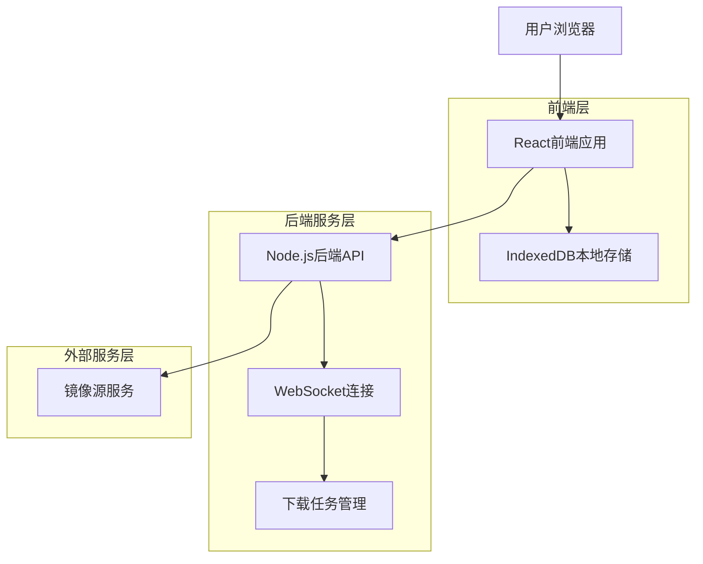
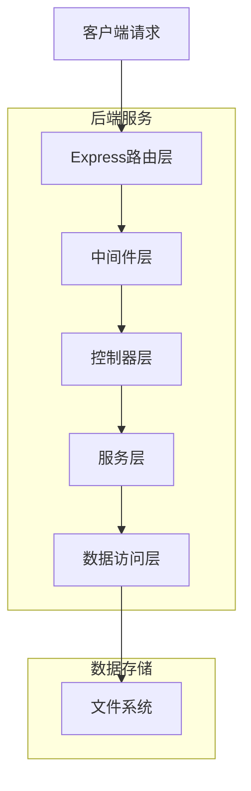

## 1. 架构设计



## 2. 技术栈描述

- **前端**: React@18 + TypeScript@5 + Vite
- **初始化工具**: vite-init
- **后端**: Node.js@20 + Express@4 + TypeScript
- **数据库**: IndexedDB (前端本地存储)
- **实时通信**: WebSocket (Socket.io)
- **UI框架**: TailwindCSS@3 + HeadlessUI
- **状态管理**: Zustand
- **HTTP客户端**: Axios

## 3. 路由定义

| 路由 | 用途 |
|------|------|
| / | 首页，镜像搜索和热门推荐 |
| /search | 搜索结果页，支持多条件筛选 |
| /download | 下载管理页，显示下载队列和进度 |
| /history | 下载历史页，查看和管理历史记录 |
| /settings | 配置页，管理镜像源和系统设置 |
| /api/health | 健康检查接口 |

## 4. API定义

### 4.1 镜像搜索API

```
GET /api/images/search
```

请求参数：
| 参数名 | 参数类型 | 是否必需 | 描述 |
|--------|----------|----------|------|
| query | string | 是 | 搜索关键词 |
| source | string | 否 | 镜像源名称 |
| architecture | string | 否 | 系统架构 |
| tag | string | 否 | 标签筛选 |

响应：
```json
{
  "code": 200,
  "data": {
    "images": [
      {
        "name": "nginx",
        "tag": "latest",
        "size": "142MB",
        "source": "dockerhub",
        "updatedAt": "2024-01-01T00:00:00Z",
        "description": "Official nginx image"
      }
    ],
    "total": 100,
    "page": 1,
    "pageSize": 20
  }
}
```

### 4.2 下载任务API

```
POST /api/download
```

请求体：
```json
{
  "imageName": "nginx:latest",
  "source": "dockerhub",
  "targetPath": "/downloads/nginx.tar",
  "enableChunked": true
}
```

### 4.3 WebSocket事件定义

```typescript
interface DownloadProgressEvent {
  type: 'download:progress';
  data: {
    taskId: string;
    progress: number;
    speed: number;
    remainingTime: number;
    downloadedBytes: number;
    totalBytes: number;
  };
}

interface DownloadCompleteEvent {
  type: 'download:complete';
  data: {
    taskId: string;
    filePath: string;
    checksum: string;
  };
}

interface DownloadErrorEvent {
  type: 'download:error';
  data: {
    taskId: string;
    error: string;
  };
}
```

## 5. 服务器架构图



## 6. 数据模型

### 6.1 IndexedDB数据模型

```typescript
interface ImageSource {
  id: string;
  name: string;
  url: string;
  priority: number;
  isActive: boolean;
  auth?: {
    username: string;
    password: string;
  };
}

interface DownloadTask {
  id: string;
  imageName: string;
  tag: string;
  source: string;
  status: 'pending' | 'downloading' | 'paused' | 'completed' | 'error';
  progress: number;
  speed: number;
  totalBytes: number;
  downloadedBytes: number;
  targetPath: string;
  createdAt: Date;
  updatedAt: Date;
  checksum?: string;
  chunks?: DownloadChunk[];
}

interface DownloadChunk {
  start: number;
  end: number;
  downloaded: boolean;
  retryCount: number;
}

interface DownloadHistory {
  id: string;
  taskId: string;
  imageName: string;
  tag: string;
  source: string;
  fileSize: number;
  downloadTime: number;
  completedAt: Date;
  checksum: string;
}
```

### 6.2 文件存储结构

```
/downloads/
├── config/
│   ├── sources.json      # 镜像源配置
│   └── settings.json     # 系统设置
├── tasks/
│   └── [task-id]/
│       ├── metadata.json # 任务元数据
│       ├── chunks/       # 分块文件
│       └── final.tar     # 最终文件
└── history/
    └── [history-id].json # 历史记录
```

## 7. 分块下载算法

### 7.1 分块策略
- 文件大小 > 500MB 自动启用分块下载
- 每个分块大小：50MB
- 最大并发分块数：5个
- 支持分块级别的重试机制

### 7.2 断点续传流程
1. 检查本地是否存在未完成的下载任务
2. 验证已下载分块的完整性
3. 重新下载损坏或缺失的分块
4. 合并所有分块生成最终文件
5. 执行文件完整性校验

## 8. 安全设计

### 8.1 传输安全
- 强制使用HTTPS协议
- 支持镜像源认证机制
- 下载内容完整性校验

### 8.2 存储安全
- 敏感信息本地加密存储
- 下载文件权限控制
- 定期清理临时文件